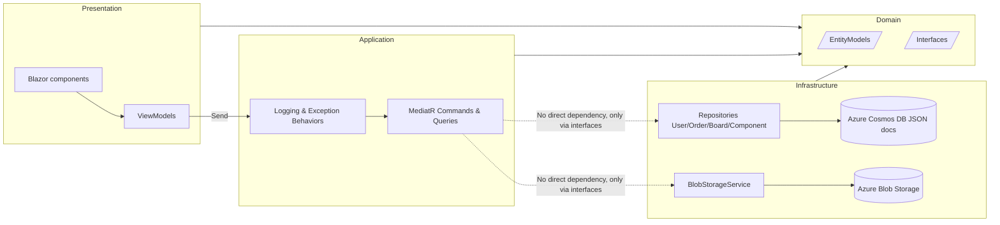

# smt-order-manager

An order manager for a SMT (Surface Mount Technology) environment - DEMO

This repository represents my solution for a coding challenge.

## Requirements (Must have)

- Platform-independend C# application
- CRUD Operations for Models (Orders, Boards, Components)
- An order can contain one or more boards
- A board can contain one or more components
- Data should be serialized to json
- Data should be persisted in a DB or file storage
- logging mechanism using a commonly adopted framework
- Apply object-oriented programming principles (e.g., SOLID, DRY), use standard design patterns, and write a unit test for at least one representative method to ensure code quality.

## Requirements (Optional)

- Use Version control
- Implement CICD pipeline
- Web-based user interface
- Backend web api
- Enable crud operations
- Include authentication
- Persistence between restarts (DB, FileStorage)
- Containerization for offline testing

## Model (suggestion from challenge)

- Order: Description, Order Date
- Board: Description, Length, Width
- Component: Description, Quantity

## Model (reworked and implemented)

- **User**:
  - `Id` (PK, UUIDv7),
  - `Email` (unique),
  - `Name`,
  - `PasswordHash`,
  - `LastLoginAt`,
  - `OrderIds: IReadOnlyList<Guid>`,
  - `Orders` (not persisted, but filled in GET requests, used for UI),
- **Order**:
  - `Id` (PK, UUIDv7),
  - `Description`,
  - `OrderDate`,
  - `Status`,
  - `UserId`,
  - `BoardIds: IReadOnlyList<QuantizedId>` (board id + quantity),
  - `Boards` (not persisted, but filled in GET requests, used for UI),
  - `CreatedAt`,
  - `UpdatedAt`
- **Board**:
  - `Id` (PK, UUIDv7),
  - `Name` (unique),
  - `Description`,
  - `Length`,
  - `Width`,
  - `ComponentIds: IReadOnlyList<QuantizedId>` (component id + quantity),
  - `Components` (not persisted, but filled in GET requests, used for UI),
  - `CreatedAt`,
  - `UpdatedAt`
- **Component**:
  - `Id` (PK, UUIDv7),
  - `Name` (unique),
  - `Description`,
  - `ImageUrl` (optional),
  - `CreatedAt`,
  - `UpdatedAt`

**NOTES**:

- Quantities are now properties of the parent entities, so we can reuse the children entities. E.g. There can be now boards with the same component but different quantities.
- CreatedAt and UpdatedAt can be used for audits.
- PK is UUIDv7 in case the DB is using B-Tree for indexing -> UUIDv7 is more performant then older UUID standards and it can be client generated, which has advantages compared to auto-incrementing indices.
- Every GET query will also fetch the related children via the child-repositories and fill in the non-persisted properties.

## Chosen Solutions for Requirements

- **Platform-independent C# app**:
  - .NET 10 Blazor App (WPF or Forms would be Windows only) -> Satisfies Web Application Requirement.
  - Solution split into Domain/Application/Infrastructure/Presentation projects (Clean Architecture).
- **CRUD for orders/boards/components**:
  - CQRS with MediatR commands/queries & validators
  - Repositories per entity (IOrderRepository, IBoardRepository, ...)
  - Blazor Server UI exposes create/edit/detail/list flows via UI.
  - No explicit REST endpoints needed since Blazor is a server side rendered application.
  - Instead of separate Create and Update implementations I used `AddOrUpdate` mostly
  - (However Blazor also supports REST endpoints in case they have to be exposed)
- **Relations (orders→boards, boards→components)**:
  - Enforced through `QuantizedId` collections on aggregates and dedicated `Add*/Update*/Delete*` commands.
  - Instead of the Component holding the Quantity, I chose the Board to know the Quantity of each Component via the `QuantizedId` type.
  - Additionally The `Order` has the same type implemented to know the quantity of boards in the order.
- **JSON serialization**:
  - Cosmos DB stores JSON documents
  - Entities decorated with Newtonsoft.Json attributes.
- **Persistence**:
  - Azure Cosmos DB for entities
  - Azure Blob Storage for component images
  - Both configurable via appsettings or `.env` file
- **Logging**:
  - Serilog configured for console/debug/rolling-file sinks
  - ILogger\<T> is injected in every service, so the log includes the classname of `T`
  - MediatR logging & exception behaviors -> Every request is logged through Mediator Behaviors
  - Debug logs are guarded through Logger.IsEnabled() for performance
- **OO/Design patterns + testing**:
  - Clean Architecture
  - Repository pattern
  - Dependency Injection & Dependency Inversion
  - Mediator & CQRS (Command-Query-Responsibility-Segregation)
  - Result & Result\<T> class is used on every public method for cleaner error handling
  - xUnit tests with Moq/FluentAssertions for command handlers and Cosmos repositories.
- **Optional extras implemented**:
  - App is hosted on Azure Web App with CosmosDB & Blob Storage
  - GitHub Actions CI + release to Azure Web App Container
    - Build and Test on every commit & PR
    - Deployment to Azure on Commit/PR to `main` (main is guarded to only allow merges through PR)
  - Dockerfile for the Blazor host (in Presentation Layer)
  - Authentication & Authorization via Blazor UI login and Authorize Guard on all pages except login and register.
    - Login via Email and Password
    - Password is hashed via IPasswordHasher (from .NET) and stored in the DB
  - Persistence across restarts via Cosmos/Blob.
  - The application layer and the infrastructure layer have a high unit test coverage
  - One Integration Test was added to test the live behavior of the RegisterCommand (see `\test\SmtOrderManager.Tests\Integration\RegisterUserIntegrationTests.cs`) 
    - Reuses the same DependencyInjection Setup from the Presentation Layer to be fully representable for the live system
    - Skipped in the CICD pipeline
    - Guarded through custom `IntegrationFactAttribute`
  - The application **cannot** be tested fully offline locally (Cosmos emulator image is available but buggy on some hosts; the app container still builds/runs locally or in Azure when live connection strings are provided.)

## Architecture

## Running the solution

- Prerequisites: .NET 10 SDK, Azure Cosmos DB connection string (or local emulator), Azure Blob Storage connection.
- Configure secrets via `src/Presentation/SmtOrderManager.Presentation/.env` or environment variables:
  - `CosmosDb__ConnectionString`, (for CosmosDb Read/Write access)
  - `BlobStorage__ConnectionString`, (for writing blobs)
  - `BlobStorage__SasToken` (for non-public blob access in the UI)
- Non-Secret configuration via `appsettings.json`
- Local run:
  - `dotnet restore`
  - `dotnet run --project src/Presentation/SmtOrderManager.Presentation`
  - App is reachable at https://localhost:7144 (dev defaults).
- Docker:
  - Build app: `docker build -t smt-order-manager -f src/Presentation/SmtOrderManager.Presentation/Dockerfile .`
  - Run container with env vars pointing to Cosmos/Blob endpoints
- Tests: `dotnet test SmtOrderManager.sln`

## CI/CD

- CI workflow (`.github/workflows/ci.yml`): restore, build, test on every push/PR.
- Release workflow (`.github/workflows/release.yml`): build/test, build Docker image, push to Azure Container Registry, deploy to Azure Web App for `main`.
